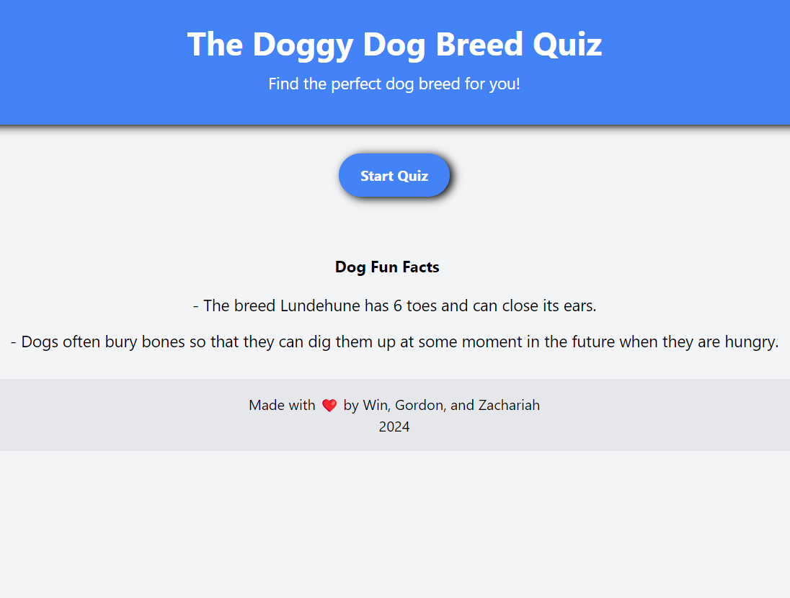
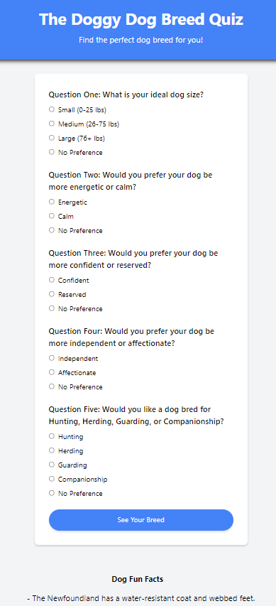
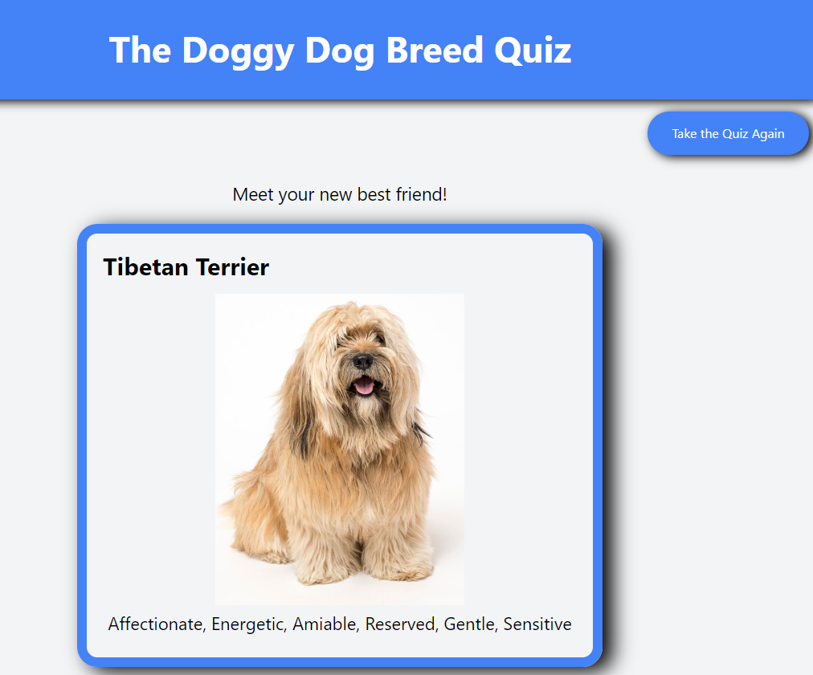
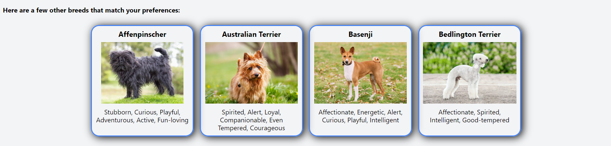
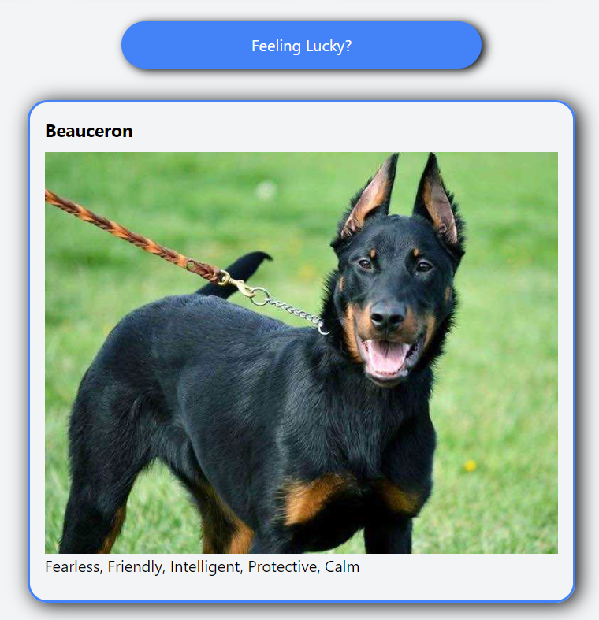

# Dog Quiz App

Welcome to the Dog Quiz App! This is a fun and educational quiz that tests your knowledge about various dog breeds. Whether you're a dog enthusiast or just curious about different breeds, this quiz is for you!

Live Site URL: https://zachariahkb.github.io/dog-breed-quiz/ 

## Features

- Multiple-choice questions about various dog breeds.
- Interesting breed suggestions based on your choices.
- Also offer other suggestions back-up breed suggestions.
- There's a Feeling Lucky button, in case you just want to see a random breed!

## Technologies Used

This app is built using the following technologies:

- HTML
- CSS
- JavaScript
- Tailwind CSS

## How to Play

1. Visit the website at: https://zachariahkb.github.io/dog-breed-quiz/ 
2. Start the quiz by clicking on the "Start Quiz" button.
3. Read each question carefully and select the answer you prefer.
4. Once you've answered all the questions, click the "Submit" button to see your suggestion breed.

## Screenshots

## Contributing

Contributions are welcome! If you have any suggestions for new features, bug fixes, or improvements, feel free to open an issue or submit a pull request.

Made By
- [Win Pomerantz](https://github.com/winpom)
- [Gordon Kwan](https://github.com/pandord24)
- [Zachariah Keiler-Bradshaw](https://github.com/ZachariahKB)

## APIs Used

This project relies on the following APIs for data:

- [The Dog API](https://thedogapi.com): Provides breed information, including images and characteristics, used in the quiz questions.
- [Dog CEO's Dog API](https://dog.ceo/dog-api/): Offers fun facts and additional information about dogs, enhancing the quiz experience with interesting tidbits.

## License

This project is licensed under the MIT License - see the [LICENSE](/LICENSE) file for details.

## Acknowledgements

- This project was inspired by our love for pets and passion for learning about coding.
